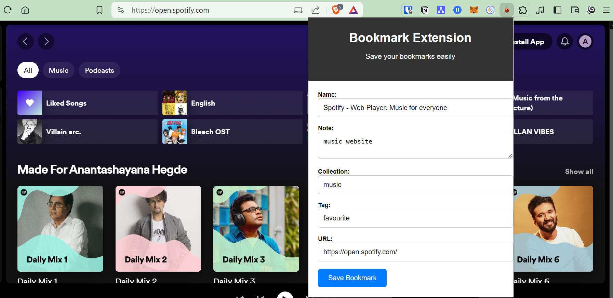
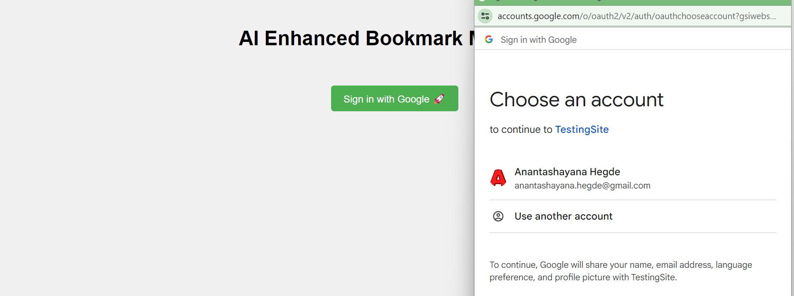
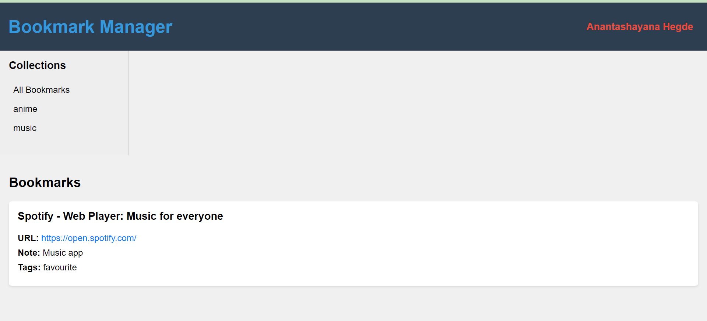

Extension
- Bookmark name, url, tag, collection  -> Backend api

Web
- Web interface
- Collection management
  
Backend
- apis to accept new bookmarks
- apis to send data
- database

Deploy
- Vercel

## Extension

## SSO sign in

## Bookmarks User Portal
